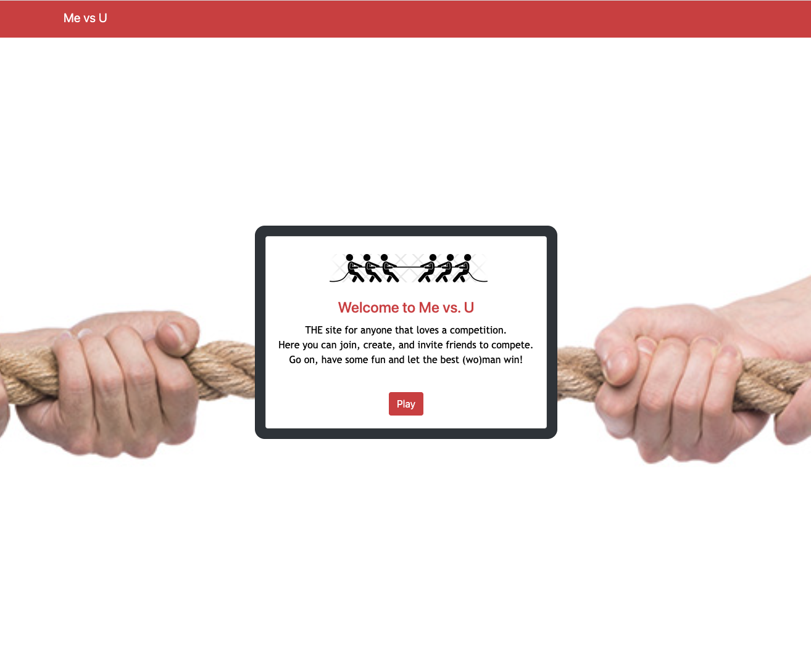

# MEvsU

It’s said that when chased by a bear, you don’t need to outrun the bear; you just need to outrun your friend. Similarly, to win a championship, a promotion, or a date, you need only to beat the immediate competition, whether a team, a colleague, or a fellow suitor. Welcome to MeVsU, your ultimate competition website. Here you can create, participate and invite friends to compete. Let the best (wo)man win.

User Story
As a competitive person I want to create, compete and invite friends into competitions.

Technologies Used
MeVsU is powered through HTML, CSS, Bootstrap, Javascript, and Node js

Directions for future development:

Website Preivew

Github Link
https://github.com/jgarner828/ME-vs-U

Credits
mel-ificent(Melissa Donato): Backend

jgarner828(Justin Garner): Backend

John45p(John Quintanilla): Backend

SarahLabrotLientz(Sarah Labrot): Frontend Web Design

Google Slide Deck
https://docs.google.com/presentation/d/1WbTrxoJbvujOxdYYauZilv8VKydQMiPmqo8DaeFDHvw/edit#slide=id.g1135d2bb876_0_116
