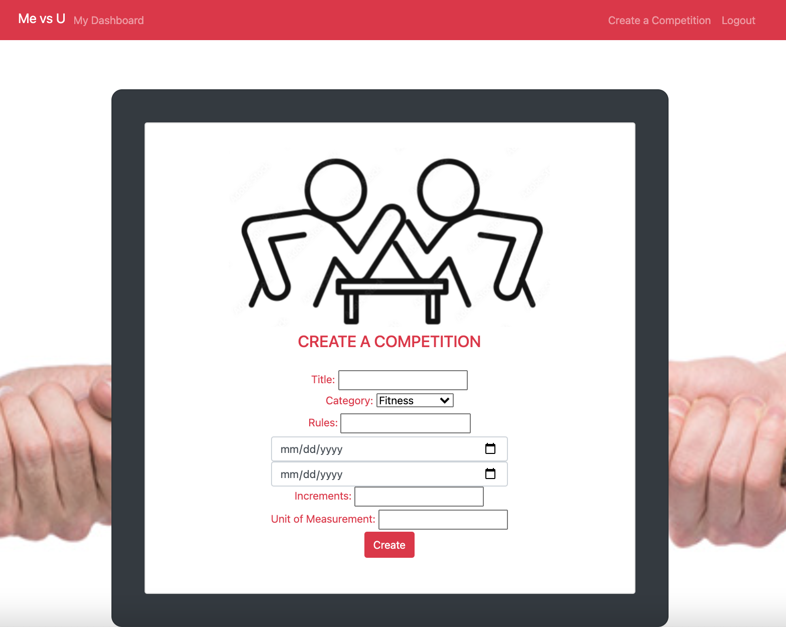

# MEvsU

It’s said that when chased by a bear, you don’t need to outrun the bear; you just need to outrun your friend. Similarly, to win a championship, a promotion, or a date, you need only to beat the immediate competition, whether a team, a colleague, or a fellow suitor. Welcome to MeVsU, your ultimate competition website. Here you can create, participate and invite friends to compete. Let the best (wo)man win.

## User Story

As a competitive person I want to create, compete and invite friends into competitions.

### Functionality

MeVsU is deployed on Heroku, see the link below. It is mobile responsive with dynamic HTML, CSS, Bootstrap, Javascript, Node js and cfonts. We decided to use cfonts because we wanted a wow factor not only on our website but also in the terminal.

### Directions for Future Development

--We would like to utilize other applications to help populate our competition inputs. ie, myfitness pal(you would be able to add calories if you're doing that competition about who
can eat the least amount of calories),or you could be able to add miles and steps througn an app called map my run, which is an fitness app that counts your steps and miles.
--We would like the ability to make the competitions either public or private. ie, you can compete with your own personal friends or you can compete and
view competitions around the world that are happening at that moment.
--We would like to develop a search function for adding people to your competition. For example: choosing from a list in your personal friend group or choosing people from a general
database.
--We would also like to link it to social media so our users can show off their progress to their friends.

and Lastly, We would like to add more options to the reward system for our competitions.

## Website Preview

### Login

### User Dashboard Pages

### Pending Competition Invites

### Create a New Competition

### cfont in the console

## Heroku Link

Heroku Link
https://fast-beach-60601.herokuapp.com/

## Github Link

Github Link
https://github.com/jgarner828/ME-vs-U

## Credits

mel-ificent(Melissa Donato): Backend

jgarner828(Justin Garner): Backend

John45p(John Quintanilla): Backend

SarahLabrotLientz(Sarah Labrot): Frontend Web Design

## Google Slide Deck

https://docs.google.com/presentation/d/1WbTrxoJbvujOxdYYauZilv8VKydQMiPmqo8DaeFDHvw/edit#slide=id.g1135d2bb876_0_116
